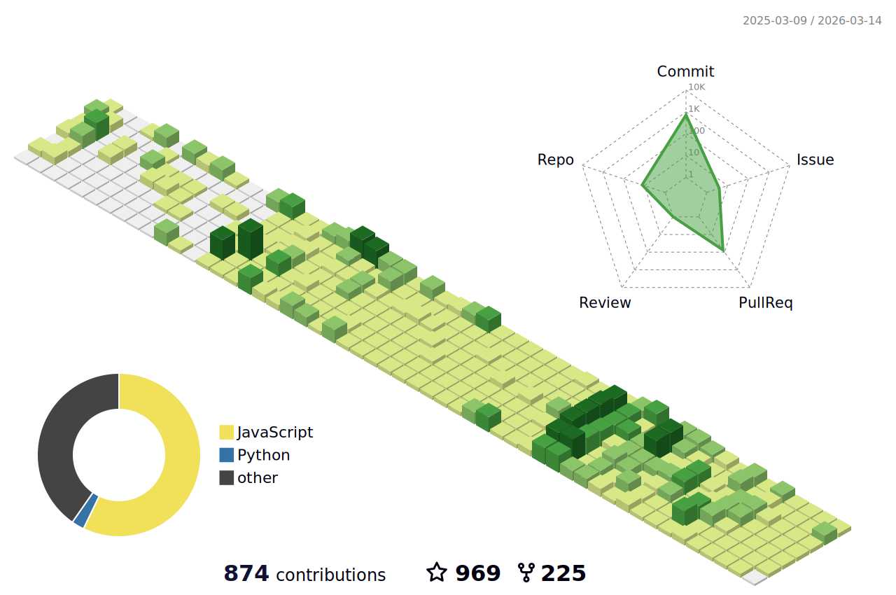

<h1 align="center">Hi 👋, I'm wkylin</h1>
<h3 align="center">A passionate frontend developer from China</h3>

- 🔭 I’m currently working on [pro-react-admin](https://wkylin.github.io/pro-react-admin/)

- 🌱 I’m currently learning **React,NodeJs, Remix, GraphQL, Prisma, MongoDB, Docker, Qiankun, DevOps**

- 👨‍💻 All of my projects are available at [https://github.com/wkylin](https://github.com/wkylin)

- 📫 How to reach me **wkylin.w@gmail.com**

- ⚡ Fun fact **I think I am funny**

#### Connect with me:

   
   
   
   
  
  <a href="[https://juejin.cn/user/289926798641176](https://app.daily.dev/wkylin)" target="blank"><svg viewBox="0 0 35 20" xmlns="http://www.w3.org/2000/svg" class="h-logo"><g fill="var(--theme-text-primary)" fill-rule="nonzero"><path d="M29.5925 9.99823L25.7884 6.1862L27.6895 2.37549L33.8703 8.5693C34.6579 9.35848 34.6579 10.638 33.8703 11.4272L26.2629 19.0506C25.4753 19.8398 24.1985 19.8398 23.411 19.0506C22.6234 18.2614 22.6234 16.9819 23.411 16.1927L29.5925 9.99823Z" fill-opacity="0.64"></path><path d="M23.4118 0.947675C24.1993 0.158497 25.4765 0.158828 26.264 0.948006L27.6903 2.37727L11.05 19.0524C10.2625 19.8415 8.98533 19.8412 8.1978 19.052L6.77152 17.6228L23.4118 0.947675ZM16.28 6.18864L13.4275 9.04718L9.62342 5.23514L4.86849 10L8.67256 13.8121L6.77152 17.6228L0.590647 11.429C-0.196882 10.6398 -0.196882 9.36026 0.590647 8.57108L8.1978 0.948006C8.98533 0.158828 10.2625 0.158497 11.05 0.947675L16.28 6.18864Z"></path></g></svg></a>
  

#### Tools:

                 

#### Languages:

#### My Stats:

  
  

#### My contribution graph get eaten by the snake 🐍:

<!--
### Streak:

<!--
### Profile 3d contrib

-->
