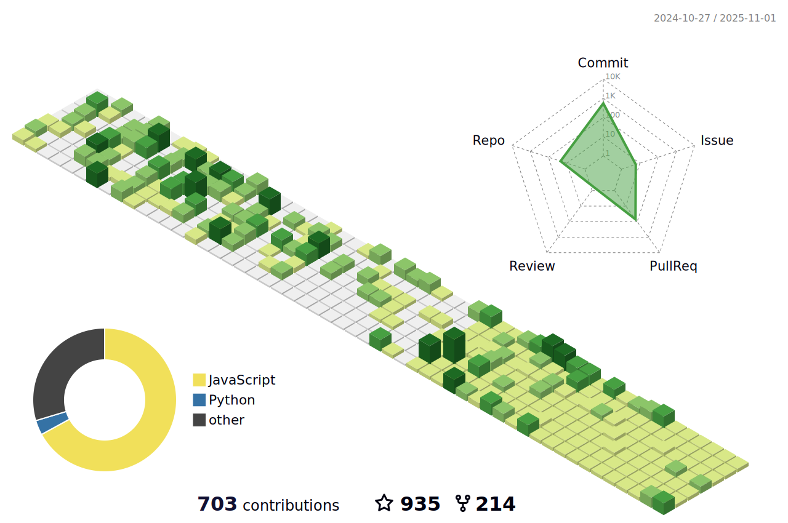

<h1 align="center">Hi 👋, I'm wkylin</h1>
<h3 align="center">A passionate frontend developer from China</h3>

- 🔭 I’m currently working on [pro-react-admin](https://wkylin.github.io/pro-react-admin/)

- 🌱 I’m currently learning **React,NodeJs, Remix, GraphQL, Prisma, MongoDB, Docker, Qiankun, DevOps**

- 👨‍💻 All of my projects are available at [https://github.com/wkylin](https://github.com/wkylin)

- 📫 How to reach me **wkylin.w@gmail.com**

- ⚡ Fun fact **I think I am funny**

#### Connect with me:

   
   
   
   
  
  
  

#### Tools:

 
    
    
   
    
    
   
    
    
   
    
    
    
   
    
    
   
   

#### Languages:

#### My Stats:

  
  

#### My contribution graph get eaten by the snake 🐍:

<!--
#### Daily.dev

-->
<!--
### Streak:

<!--
### Profile 3d contrib

-->
